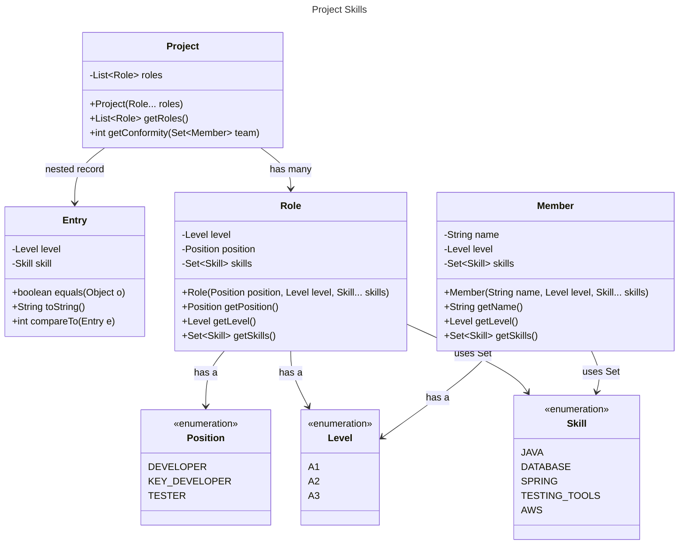

Create a `Set<Entry`> ($Set_0$) from the `Roles` defined by the Project and then create a `Set<Entry>` ($Set_1$) from the `team` of type `Set<Member>`. And then computing de intersection between both sets.  $Set_0 \cap Set_1$ (`retainAll()`). $(\vert Set_0 \cap Set_1 \vert  * 100) / \vert Set_0 \vert$

