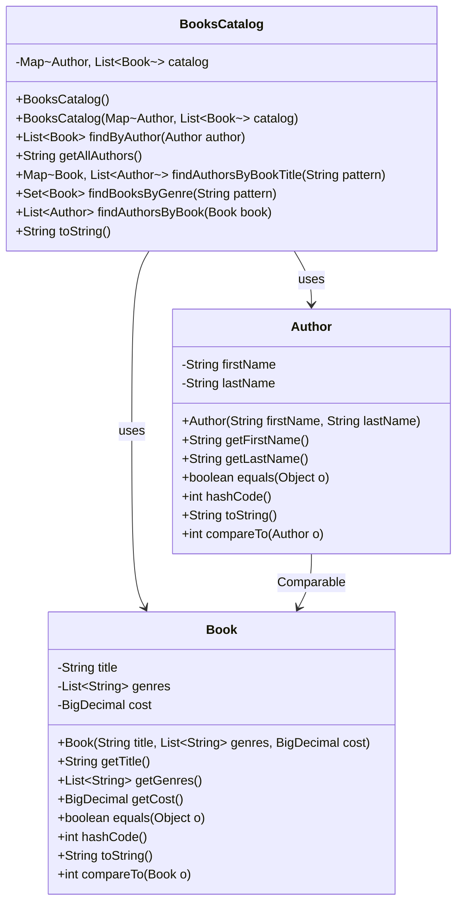

```mermaid
classDiagram
    class Author {
        -String firstName
        -String lastName
        +Author(String firstName, String lastName)
        +String getFirstName()
        +String getLastName()
        +boolean equals(Object o)
        +int hashCode()
        +String toString()
        +int compareTo(Author o)
    }

    class Book {
        -String title
        -List~String~ genres
        -BigDecimal cost
        +Book(String title, List~String~ genres, BigDecimal cost)
        +String getTitle()
        +List~String~ getGenres()
        +BigDecimal getCost()
        +boolean equals(Object o)
        +int hashCode()
        +String toString()
        +int compareTo(Book o)
    }

    class BooksCatalog {
        -Map~Author, List~Book~~ catalog
        +BooksCatalog()
        +BooksCatalog(Map~Author, List~Book~~ catalog)
        +List~Book~ findByAuthor(Author author)
        +String getAllAuthors()
        +Map~Book, List~Author~~ findAuthorsByBookTitle(String pattern)
        +Set~Book~ findBooksByGenre(String pattern)
        +List~Author~ findAuthorsByBook(Book book)
        +String toString()
    }

    BooksCatalog --> Author : uses
    BooksCatalog --> Book : uses
    Author --> Book : Comparable
```

